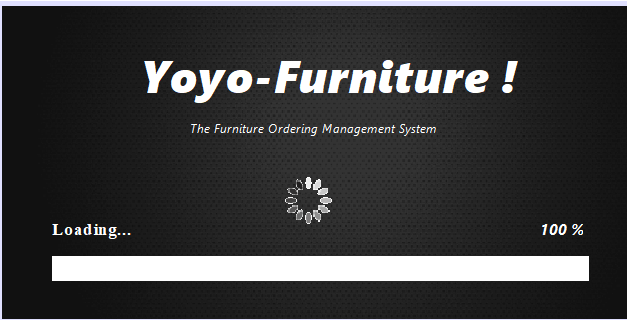
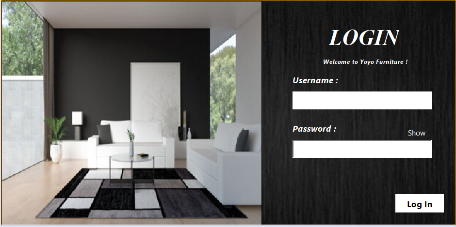
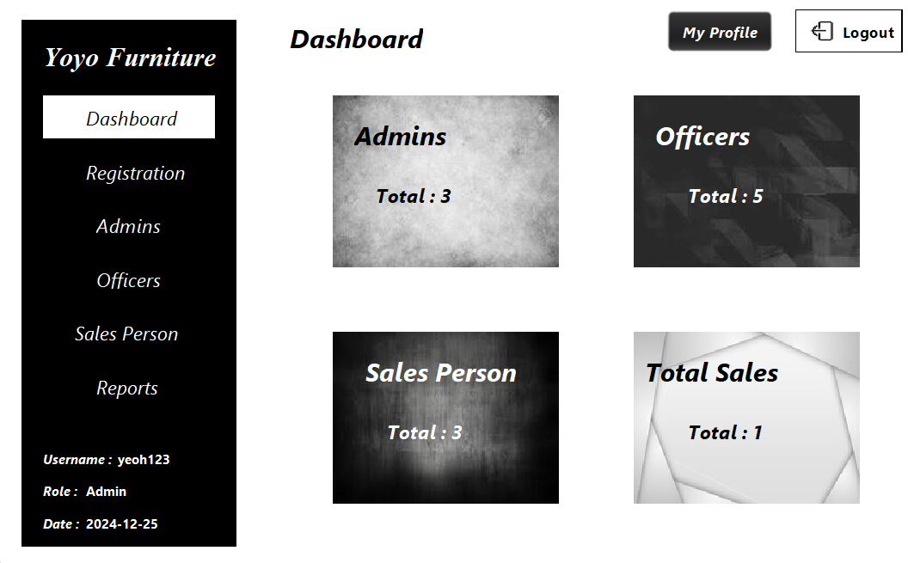
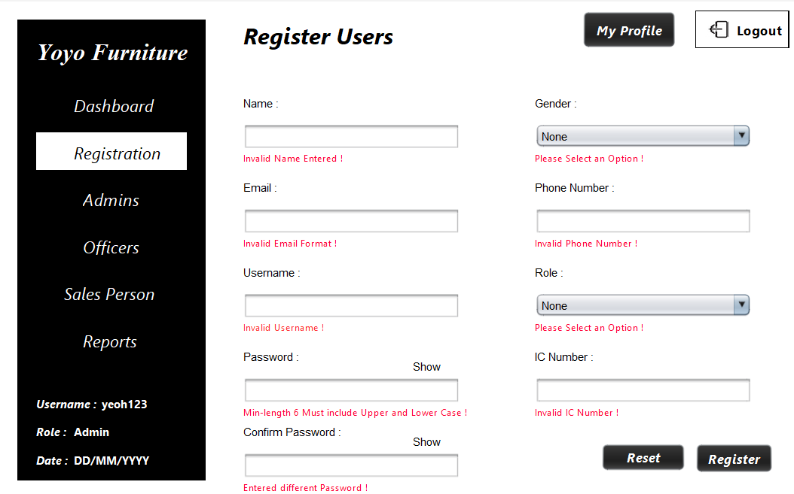
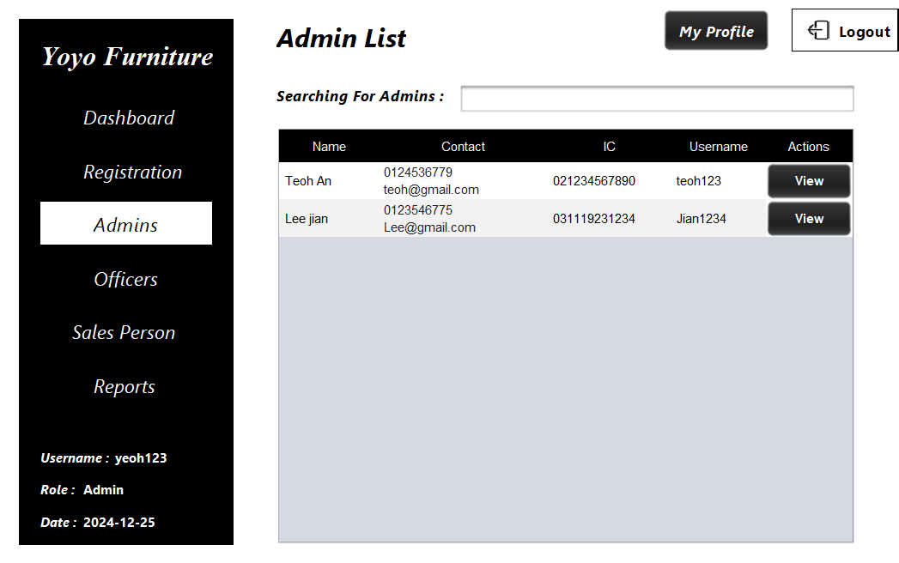
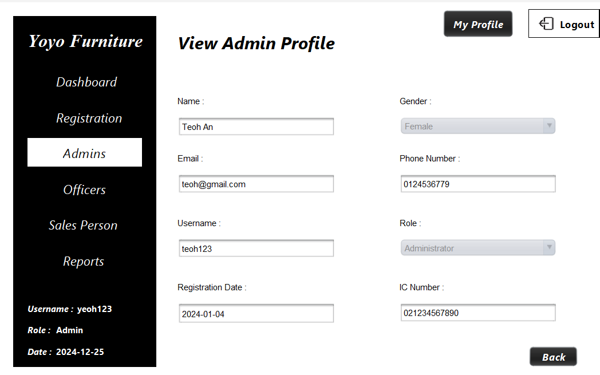
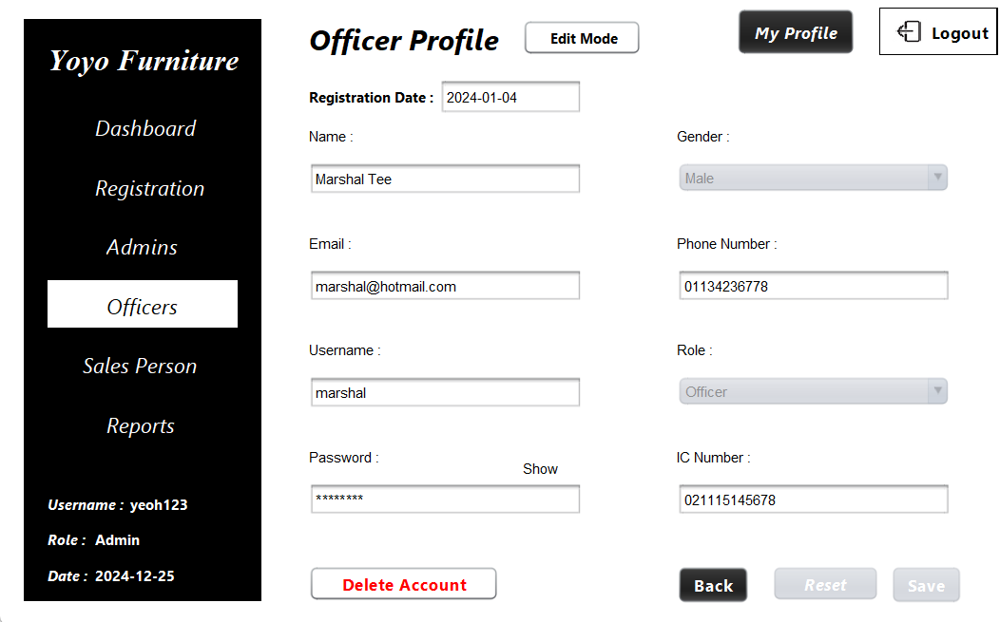
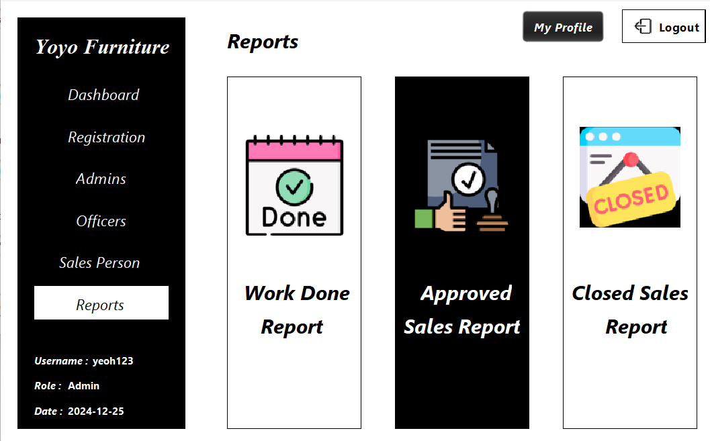
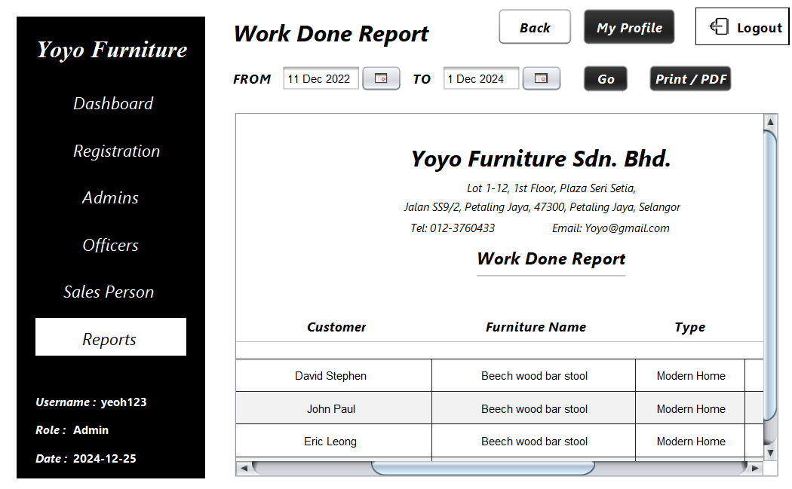
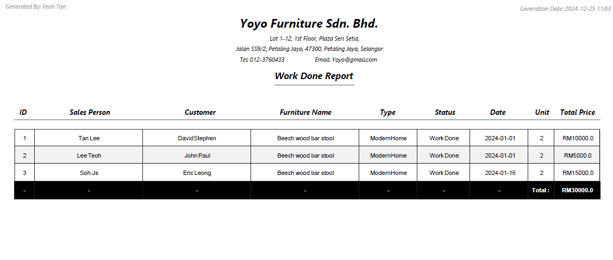

# Yoyo Furniture (Sales Order Management System) - Admin Interface

A Sales Order Management System (Names as Yoyo Furniture) Built with Java Programming Language and Java Swing Library. 

## Requirements:

- Java SDK Version >= 19

- Netbeans IDE Version >= 16 (Preferable) (or Any Relevant IDE)

## Functionalities:

1. CRUD of Users Information and Permissions
2. User Authentication
3. Report Generation (Workdone, Sales, History)
4. Display System Summary Report (Users, Admins and etc.)
5. Validation of Entry Data
6. Protection on Data Modification

# UI:
                     


# Setup:
Step 1:
```bash
git clone https://github.com/Sjiaseng/Yoyo-Furniture.git
```

Step 2:

Open Folder in Netbeans IDE -> Execute Program


## Text Files Introduction:
- User.txt -> User Login Credentials / Information & Roles
- Invoice.txt -> Generate Invoices as Report and Keep Records of the Profits
- Sales.txt -> Order Status of Furnitures Made by Clients
